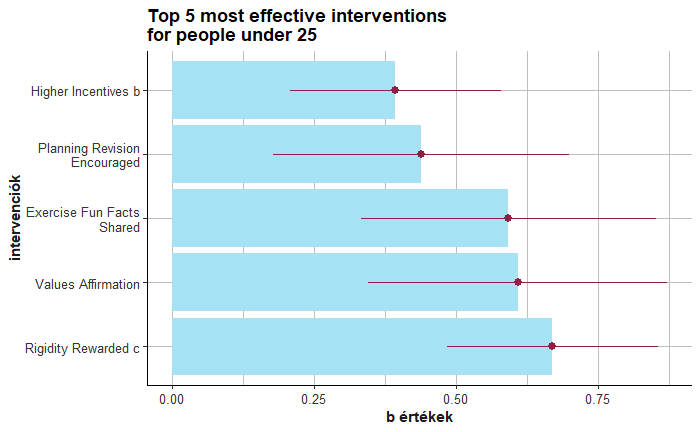

# personalised_behavioural_intervention_analysis

# Goal of the project:

The aim of the project is to re-analyse a large-scale field study on the effectiveness of behavioural interventions in order to better determine the effectiveness of interventions by taking heterogeneity into account and identify the most effective interventions for each individual, as compared to the overall impact using bootstrapping and machine learning methods.

## The problem the analysis seeks to solve:

It is common practice to ignore heterogeneity when analysing the effectiveness of different behavioural interventions. When trying to select the most effective intervention for an individual, ignoring individual differences and using the most effective intervention across the population in each case potentially misses a lot of potential for improvement.
The aim of this project is to demonstrate the drawbacks of this procedure using a bootstrapping analysis and to use a random forest model to demonstrate one way to determine the most appropriate intervention for each individual person based on their personal characteristics.

## The steps of the project:

1.	Demonstration of the problem of ignoring individual characteristics using bootstrapping analysis.

2.	Demonstrating the non-randomness of differences using subsample analysis.

3.	Pilot demonstration of a solution proposal using machine learning models.

## Skills gained through the project:

•	data cleaning and transformation using R

•	handling big data

•	implementation of complex analyses such as bootstrapping and random forest

•	data visualisation

## The original study, which is reanalysed in this project:

The most comprehensive study in the field of intervention research is the mega-study presented by Milkman and colleagues (2021), in which 30 researchers worked together to compare the effectiveness of 54 different physical activity interventions on a sample of 61,293 people. In the mega-study design, researchers compare the effects of different interventions in the same population, using the same measurement tool, over the same time period in a large field study. The aim of the mega-study design demonstrated by the authors is to compare the effects of different interventions with each other, in order to identify the most effective interventions in influencing behaviour in a positive direction (in this case, encouraging more frequent physical activity). In this study, the authors compared the effect of 52 different interventions on average weekly gym attendance with the average weekly gym attendance of a control (placebo) group (Milkman et al., 2021)*.

*Milkman, K. L., Gromet, D., Ho, H., Kay, J. S., Lee, T. W., Pandiloski, P., Park, Y., Rai, A., Bazerman, M., Beshears, J., Bonacorsi, L., Camerer, C., Chang, E., Chapman, G., Cialdini, R., Dai, H., Eskreis-Winkler, L., Fishbach, A., Gross, J. J., … Duckworth, A. L. (2021). Megastudies improve the impact of applied behavioural science. Nature, 600(7889), 478–483. https://doi.org/10.1038/s41586-021-04128-4

# Analysis

## First step: 
Demonstration of the problem of ignoring individual characteristics using bootstrapping analysis.

In the bootstrapping analysis, 100 samples were randomly drawn from the original sample, and the original regression analysis was re-run on each sample, to determine the most effective interventions in each sample, and to determine the variance of the effectiveness of the most effective intervention in the original study.

The results show that intervention number five, which was initially considered the most effective intervention in the bootstrapping analysis, proved to be the most effective in only 19% of cases. 
This means that, on an average sample, 81% of the time, using a different intervention to change behaviour (in this case, encouraging more regular exercise) will produce more effective results.

## Second step: 
Demonstrating the non-randomness of differences using subsample analysis.

In this analysis, we did not randomly sample, but created sub-samples along different variables, such as young people, regular exercising, women, etc., in order to identify the most effective interventions for each group.

The results show how much difference there is between groups defined along the different variables in terms of which interventions are most effective.

## Third step: 
Pilot demonstration of a solution proposal using machine learning models.

In this step, the sample was divided into a learning set and a test set, and a random forest model was developed on the learning set using the different individual variables. The effectiveness of the model was measured on the test set.

On the test sample, the mean squared error of the difference between the effect of the intervention predicted by the random forest model and the effect of the real intervention was 1.178.
Translated, on average, the model was wrong by about one day in determining how many days a person will exercise per week after a given intervention.

The model is not perfect and can be further improved by determining the most optimal model parameters, using alternative machine learning methods and including more individual variables.
Nevertheless, the method demonstrates the potential of using machine learning models to determine individualised behavioural interventions. 
